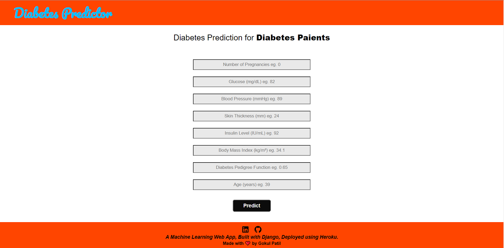
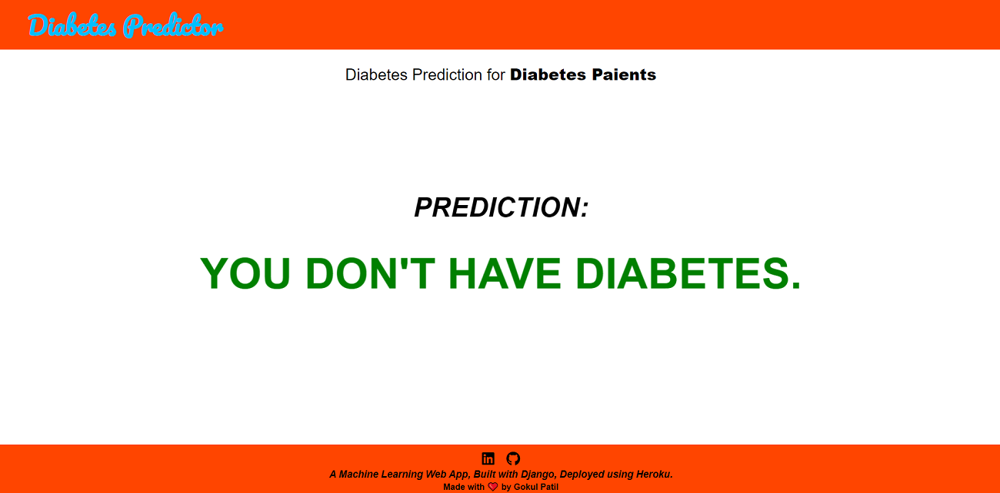
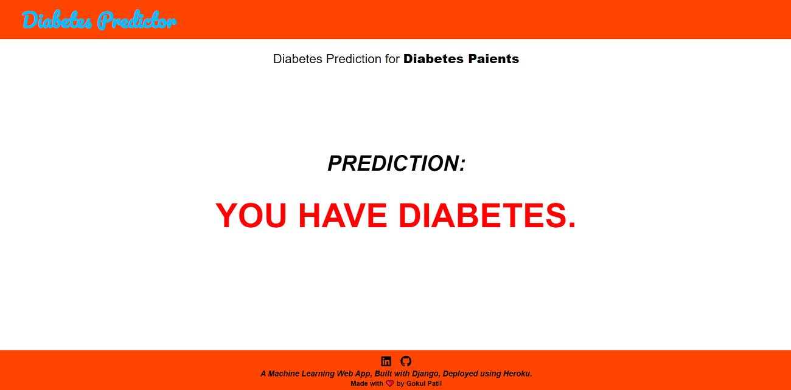

# Diabetes-Prediction-Deployment

     

• This repository consists of files required to deploy a ___Machine Learning Web App___ created with ___Django___ on ___Heroku___ platform.

• If you want to view the deployed model, click on the following link: 
Deployed at: _https://diabetes-disease-predictor.herokuapp.com/_

_**----- Algorithms -----**_ 
• If you are searching for __Code__, __Algorithms used__ and __Accuracy__ of the model.. you won't find it here. Click the link mentioned below for the same: 
Link: _https://github.com/gokul-patil0509/Data-Science-Projects/tree/main/Diabetes-Prediction-Deployment_

• Please do ⭐ the repository, if it helped you in anyway.

• A glimpse of the web app:

 
 
 _**----- PREDICTION NO:-1 -----**_ 
 
  
  
  _**----- PREDICTION NO:-2 -----**_ 
  
  
